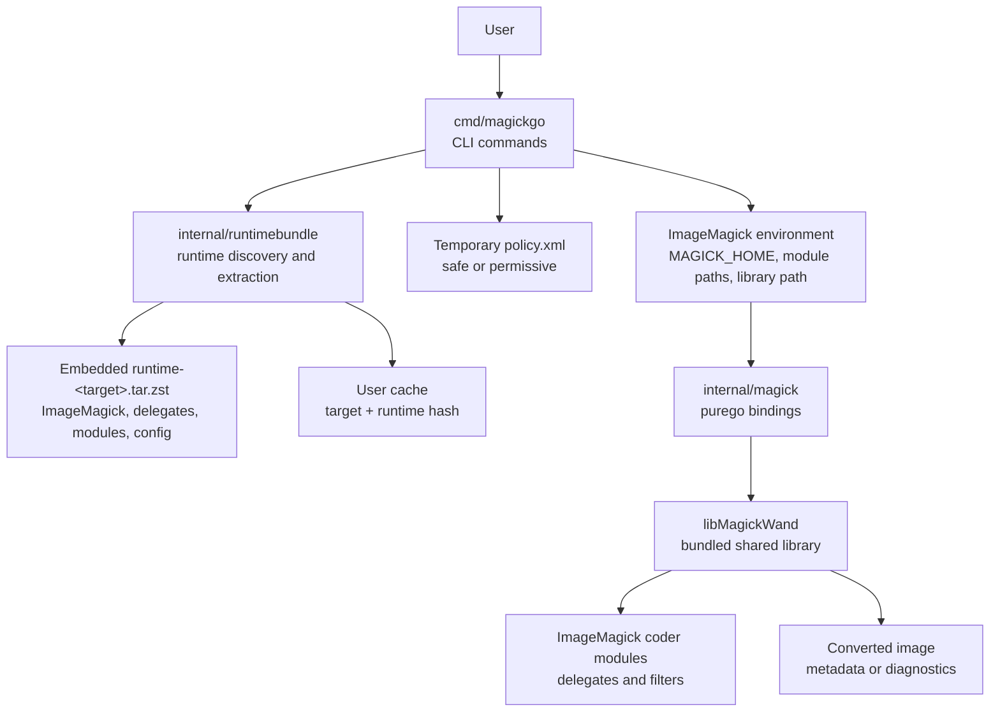
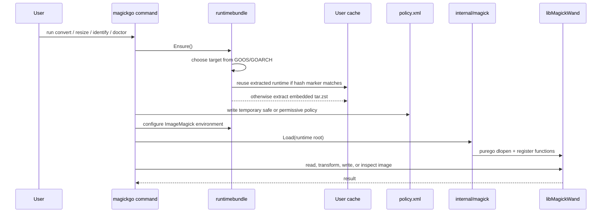

# magick-go

[English](README.md)

`magickgo` は、Go で作られたスタンドアロンの ImageMagick 7 CLI です。

ImageMagick 本体、delegate ライブラリ、coder module、設定ファイルを
1 つの Go バイナリに埋め込みます。初回実行時にユーザーキャッシュへ展開し、
[`purego`](https://github.com/ebitengine/purego) 経由で `libMagickWand` を呼び出します。
そのため、システムに ImageMagick をインストールせず、CGO なしで画像変換を実行できます。

## できること

- 主要な画像形式、プロ向け形式、ドキュメント形式の変換。
- アスペクト比を維持したリサイズ。
- 画像形式、サイズ、色深度などのメタデータ取得。
- バンドルされた ImageMagick が対応している形式の一覧表示。
- PDF、PS、EPS、MVG、MSL、URL、HTTP、HTTPS などをデフォルトでブロックする安全寄りの policy。

## 対応ターゲット

| OS | アーキテクチャ | ターゲット |
| --- | --- | --- |
| Linux | amd64 | `linux-amd64` |
| Linux | arm64 | `linux-arm64` |
| macOS | arm64 | `darwin-arm64` |

## クイックスタート

まず ImageMagick runtime bundle を作り、その後 Go CLI をビルドします。

```sh
# Linux の例
bash scripts/build-runtime-linux.sh linux-amd64 internal/runtimebundle/assets/runtime-linux-amd64.tar.zst

# macOS の例
bash scripts/build-runtime-darwin.sh darwin-arm64 internal/runtimebundle/assets/runtime-darwin-arm64.tar.zst

CGO_ENABLED=0 go build -o dist/magickgo ./cmd/magickgo
```

診断情報を確認します。

```sh
dist/magickgo doctor --verbose
```

画像の確認、変換、リサイズを実行します。

```sh
dist/magickgo identify input.png
dist/magickgo convert input.heic output.webp
dist/magickgo convert input.png output.jpg --quality 85 --strip
dist/magickgo resize input.jpg output.webp --width 1200
```

## コマンド

| コマンド | 用途 |
| --- | --- |
| `magickgo doctor [--verbose] [--json]` | runtime、ライブラリ、delegate、対応形式を診断します。 |
| `magickgo formats [--json]` | バンドルされた ImageMagick に登録されている形式を一覧表示します。 |
| `magickgo identify [options] input.png` | 画像メタデータを表示します。 |
| `magickgo convert [options] input output` | 画像を別形式へ変換します。 |
| `magickgo resize [options] input output --width N` | 幅を指定して、アスペクト比を維持したままリサイズします。 |

### 共通オプション

| フラグ | 説明 |
| --- | --- |
| `--quality N` | 出力品質を指定します。多くの形式では `1` から `100` です。 |
| `--strip` | EXIF などのメタデータを削除します。 |
| `--auto-orient` | EXIF の向き情報を反映してから書き出します。 |
| `--format FMT` | 出力形式を明示的に指定します。 |
| `--json` | 対応コマンドの出力を JSON にします。 |
| `--verbose` | `doctor` で詳細な診断情報を表示します。 |
| `--policy safe\|permissive` | デフォルトの安全 policy、または全許可 policy を使います。 |
| `--unsafe-enable-pdf` | この実行だけ PDF、PS、EPS を有効化します。信頼できる入力では `--policy permissive` も使えます。 |

## アーキテクチャ



起動時の流れは次の通りです。



runtime はターゲットと bundle hash ごとにキャッシュされます。

- Linux: OS のユーザーキャッシュ配下。通常は `~/.cache/magickgo/runtime`。
- macOS: `~/Library/Caches/magickgo/runtime`。

## Runtime bundle の中身

`runtime-<target>.tar.zst` には、システムの ImageMagick に頼らず実行するためのファイルが入ります。

```text
bin/magick
lib/libMagickWand-7.*
lib/libMagickCore-7.*
lib/ImageMagick-*/modules-*/coders
lib/ImageMagick-*/modules-*/filters
etc/ImageMagick-7
lib/* delegate libraries
```

Go バイナリはこの archive を `//go:embed` で埋め込みます。展開先は SHA-256 hash
で決まるため、埋め込み runtime を更新すると自動的に新しいキャッシュディレクトリが使われます。

## 対応画像形式

正確な対応形式は、バンドルされた ImageMagick のビルド内容で決まります。次のコマンドで確認できます。

```sh
magickgo formats
magickgo doctor --verbose
```

代表的な対応形式は次の通りです。

| 分類 | 例 |
| --- | --- |
| Web / ラスター | JPEG, PNG, APNG, WebP, TIFF, GIF, BMP, ICO |
| モダン codec | HEIC, HEIF, AVIF, JXL |
| ベクター / ドキュメント | SVG, PDF, EPS, PS |
| プロ / 映像系 | EXR, PSD, DPX, CIN, HDR, FITS |
| JPEG 2000 | JP2, J2K, JPC, JPM |
| Netpbm | PBM, PGM, PPM, PNM, PAM, PFM |
| Camera RAW | DNG, CR2/CR3, NEF, ARW, ORF, RAF, RW2, PEF, SRW など |

### 既知の制限

| 形式または機能 | 制限 |
| --- | --- |
| PDF, PS, EPS | デフォルトの safe policy ではブロックされます。信頼できる入力に限り `--policy permissive` を使ってください。 |
| HEIC, HEIF, AVIF 書き込み | delegate のロード挙動により、ImageMagick CLI mode が必要になる場合があります。 |
| macOS の JXL | coder module が dynamic linker の挙動に依存するため、CLI mode が必要になる場合があります。 |
| SVG 書き込み | vectorization に外部コマンド `potrace` が必要です。この runtime には含まれません。 |
| Camera RAW | delegate が decode 専用のため読み取りのみです。 |

## 開発

テストを実行します。

```sh
go test ./...
```

runtime bundle を用意した後、CLI をビルドします。

```sh
CGO_ENABLED=0 go build -o dist/magickgo ./cmd/magickgo
```

このリポジトリには runtime bundle をコミットしません。CI では次のスクリプトでソースから作成します。

```sh
bash scripts/build-runtime-linux.sh linux-amd64 internal/runtimebundle/assets/runtime-linux-amd64.tar.zst
bash scripts/build-runtime-darwin.sh darwin-arm64 internal/runtimebundle/assets/runtime-darwin-arm64.tar.zst
```

CI は runtime archive をスクリプト内容の hash でキャッシュします。初回ビルドが重く、
変更がない場合はキャッシュを再利用します。
