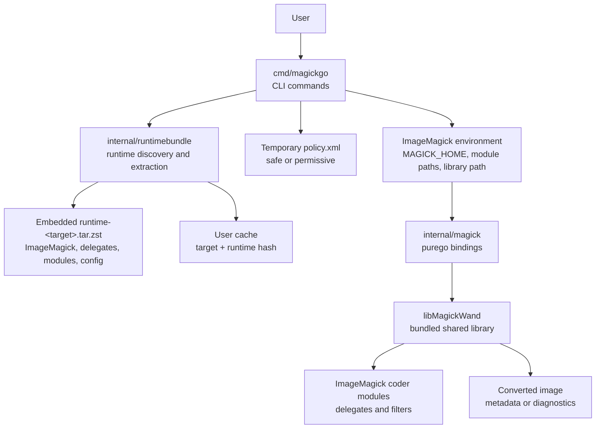
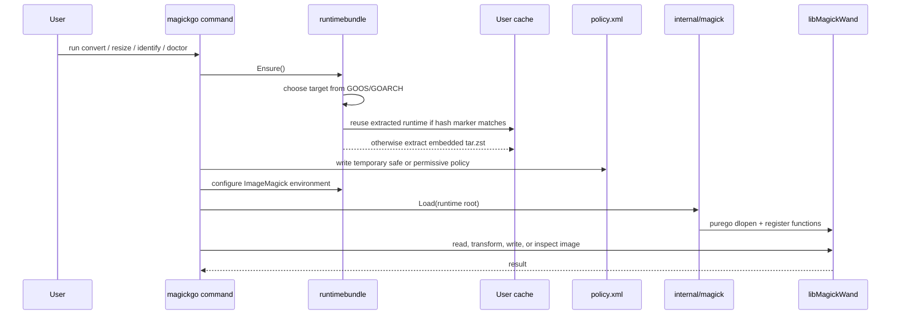

# magick-go

[日本語版](README.ja.md)

`magickgo` is a standalone ImageMagick 7 CLI built in Go.

It ships a complete ImageMagick runtime inside the binary, extracts that runtime
to the user cache on first use, and calls `libMagickWand` through
[`purego`](https://github.com/ebitengine/purego). The result is a portable image
tool with no system ImageMagick install and no CGO requirement.

## What it does

- Converts images between common and professional formats.
- Resizes images while preserving aspect ratio.
- Reads image metadata such as format, dimensions, color depth, and ImageMagick
  diagnostics.
- Lists supported formats from the bundled ImageMagick runtime.
- Uses a safe default policy that blocks risky formats and delegates such as
  PDF, PS, EPS, MVG, MSL, URL, HTTP, and HTTPS.

## Supported targets

| OS | Architecture | Target |
| --- | --- | --- |
| Linux | amd64 | `linux-amd64` |
| Linux | arm64 | `linux-arm64` |
| macOS | arm64 | `darwin-arm64` |

## Quick start

Build a runtime bundle, then build the Go CLI:

```sh
# Linux example
bash scripts/build-runtime-linux.sh linux-amd64 internal/runtimebundle/assets/runtime-linux-amd64.tar.zst

# macOS example
bash scripts/build-runtime-darwin.sh darwin-arm64 internal/runtimebundle/assets/runtime-darwin-arm64.tar.zst

CGO_ENABLED=0 go build -o dist/magickgo ./cmd/magickgo
```

Run diagnostics:

```sh
dist/magickgo doctor --verbose
```

Convert and resize images:

```sh
dist/magickgo identify input.png
dist/magickgo convert input.heic output.webp
dist/magickgo convert input.png output.jpg --quality 85 --strip
dist/magickgo resize input.jpg output.webp --width 1200
```

## Commands

| Command | Purpose |
| --- | --- |
| `magickgo doctor [--verbose] [--json]` | Show runtime, library, delegate, and format diagnostics. |
| `magickgo formats [--json]` | List formats registered by the bundled ImageMagick runtime. |
| `magickgo identify [options] input.png` | Print image metadata. |
| `magickgo convert [options] input output` | Convert one image to another format. |
| `magickgo resize [options] input output --width N` | Resize to a target width with aspect ratio preserved. |

### Common options

| Flag | Description |
| --- | --- |
| `--quality N` | Output quality, usually `1` to `100`, depending on the format. |
| `--strip` | Remove EXIF and other metadata. |
| `--auto-orient` | Apply EXIF orientation before writing. |
| `--format FMT` | Override the output format. |
| `--json` | Print JSON output for commands that support it. |
| `--verbose` | Print extended diagnostics for `doctor`. |
| `--policy safe\|permissive` | Use the safe default policy or allow all ImageMagick policies. |
| `--unsafe-enable-pdf` | Enable PDF, PS, and EPS handling for this run. Prefer `--policy permissive` for trusted inputs. |

## Architecture



Startup flow:



The runtime is cached by target and bundle hash:

- Linux: under the OS user cache directory, usually
  `~/.cache/magickgo/runtime`.
- macOS: `~/Library/Caches/magickgo/runtime`.

## Runtime contents

Each `runtime-<target>.tar.zst` contains the pieces required to run
ImageMagick without a system install:

```text
bin/magick
lib/libMagickWand-7.*
lib/libMagickCore-7.*
lib/ImageMagick-*/modules-*/coders
lib/ImageMagick-*/modules-*/filters
etc/ImageMagick-7
lib/* delegate libraries
```

The Go binary embeds that archive with `//go:embed`. Runtime extraction is
content-addressed by SHA-256, so updating the embedded archive creates a new
cache directory automatically.

## Supported image formats

The exact format list comes from the bundled ImageMagick build. Check it with:

```sh
magickgo formats
magickgo doctor --verbose
```

Commonly supported formats include:

| Category | Examples |
| --- | --- |
| Web and raster | JPEG, PNG, APNG, WebP, TIFF, GIF, BMP, ICO |
| Modern codecs | HEIC, HEIF, AVIF, JXL |
| Vector and documents | SVG, PDF, EPS, PS |
| Professional and cinema | EXR, PSD, DPX, CIN, HDR, FITS |
| JPEG 2000 | JP2, J2K, JPC, JPM |
| Netpbm | PBM, PGM, PPM, PNM, PAM, PFM |
| Camera RAW | DNG, CR2/CR3, NEF, ARW, ORF, RAF, RW2, PEF, SRW, and others |

### Known limitations

| Format or feature | Limitation |
| --- | --- |
| PDF, PS, EPS | Blocked by the safe default policy. Use `--policy permissive` only for trusted inputs. |
| HEIC, HEIF, AVIF write | May require ImageMagick CLI mode depending on delegate loading behavior. |
| JXL on macOS | May require CLI mode because the coder module can depend on dynamic linker behavior. |
| SVG write | Requires the external `potrace` binary for vectorization; it is not bundled. |
| Camera RAW | Read-only because the delegate decodes RAW files but does not encode them. |

## Development

Run tests:

```sh
go test ./...
```

Build the CLI after preparing a runtime bundle:

```sh
CGO_ENABLED=0 go build -o dist/magickgo ./cmd/magickgo
```

The repository does not commit runtime bundles. CI builds them from source with:

```sh
bash scripts/build-runtime-linux.sh linux-amd64 internal/runtimebundle/assets/runtime-linux-amd64.tar.zst
bash scripts/build-runtime-darwin.sh darwin-arm64 internal/runtimebundle/assets/runtime-darwin-arm64.tar.zst
```

CI caches runtime archives by script content hash, so the first runtime build is
the slow path and unchanged builds reuse the cache.
